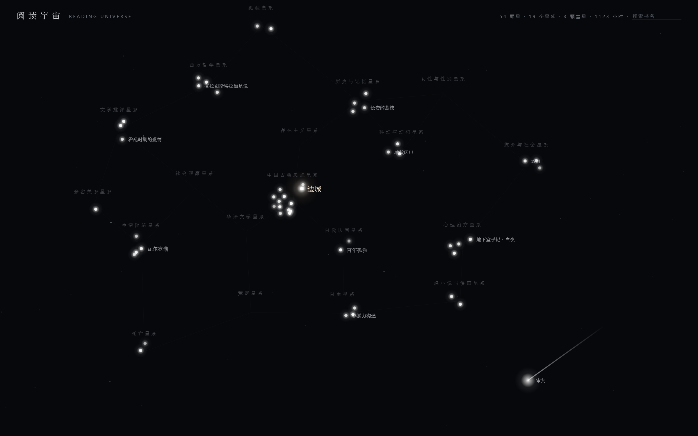

# 阅读宇宙 · Reading Universe

把读过的书变成一片星空 / 一张思维版图。数据来自你自己的微信读书（weread-skill 导出），
用一条可复现的管线生成：**书 → 主题标签 → 星图/图谱**。

> 这个仓库含**作者的真实脱敏数据**（书名/作者/主题标签/阅读时长，无划线原文/读完日期/评分），
> clone 后可直接看到效果；换用你自己的微信读书数据即可生成你自己的星图。



## 两种视图

- **宇宙模式**（`web/index.html?universe`）：恒星=书（越大读得越久、越亮笔记越多）、星系=39 个主题、彗星=离群书。拖拽/缩放/搜索。
- **图谱模式**（`web/index.html`）：书 × 主题 的知识网络，点节点看这本书通向哪里。

## 快速开始（5 步复现）

```bash
# 0. 环境：Python 3.10+，无第三方依赖（纯标准库）
# 1. 准备数据：你有两种选择
#    a. 直接用仓库自带的真实脱敏数据（clone 后 data/ 里已有）→ 跳过 2~4
#    b. 用自己的微信读书数据：把 weread-skill 的数据目录传给 sync 脚本
python pipeline/sync_from_weread.py <你的weread-skill数据目录>

# 2.（用自己的书才需要）给书打主题标签（39 词表，AI 打或手动）
export LLM_API_KEY=你的DeepSeek或OpenAI兼容key
python pipeline/tag_books.py          # AI 打标；或 --manual 手动填表
#    ⚠️ 若一本都没打上（日志全是 `LLM 失败` 或干脆没有输出），先查这两条 —— 2026-09-30 已修：
#      · **403 / Cloudflare 1010** → 请求缺 `User-Agent`（旧版没带；现已带，自建网关时也请确保保留）
#      · **跑完但全部无标签** → `max_tokens` 太小，被模型的思考过程吃光，正文回空串、脚本静默返回 []
#        （旧版写死 200；现已提到 4000。**换模型后如果它更"能想"，这个值可能还要加**）

# 3.（可选）生成主题卡（点星系弹的轨迹卡）
python pipeline/make_theme_cards.py   # 骨架；--llm 让 AI 写轨迹

# 4. 构建两种视图的数据
python pipeline/build_universe.py     # → web/universe_data.js（星空）
python pipeline/make_graph.py         # → web/graph_data.js（图谱）

# 5. 打开
#    web/index.html（图谱）或 web/index.html?universe（星空）
```

仓库自带的 data/ 是作者真实脱敏数据（336 本书 / 333 本有主题标签 / 39 主题卡），
上面 1~4 步已跑过，clone 后直接做第 5 步就能看效果。

## 数据是什么、从哪来

| 文件 | 内容 | 说明 |
|---|---|---|
| `data/books.json` | 书单元数据（title/author/readingTime/notes） | weread-skill `sync.mjs` 导出后经 `sync_from_weread.py` 脱敏 |
| `data/theme_tags.json` | 每本书的主题标签 | `tag_books.py` 按 39 词表打标 |
| `data/themes/*.md` | 每个主题的专题卡 | `make_theme_cards.py` 生成骨架 + 人工/AI 补轨迹 |
| `data/theme_wordlist.md` | 39 个主题词表 | 打标口径 |

字段级说明见 [`docs/DATA_FORMAT.md`](docs/DATA_FORMAT.md)。

## 隐私边界（重要）

本项目只发布**聚合可视化**：

- ✅ 公开：书名 + 作者、主题标签、阅读时长（聚合为星的大小）、笔记数（聚合为星的亮度）、主题关联网络
- ❌ 不公开：**划线金句原文**（版权 + 隐私）、**逐书读完日期**（阅读节奏指纹）、评分、书评、封面

`data/books.json` 是脱敏产物（无上述个人层字段）。如果你用自己数据生成，发布前
也请按此边界检查 `data/` 里没有不想公开的内容。

## 数据来源说明

你的微信读书数据可用 [weread-skills](https://github.com/) 这类工具导出
（其 `sync.mjs` 产出 `books.json`，含 title/author/readingTime/notes/finishTime 等字段）。
本仓库的 `sync_from_weread.py` 会把任意符合格式的数据整理成 `data/books.json`。
只要你把阅读数据导成那个字段结构，不一定要用 weread-skills。

## 部署

纯静态站，任意托管可发（GitHub Pages / Nginx / Vercel / 对象存储）。见 `docs/DEPLOY.md`。

## License

MIT
