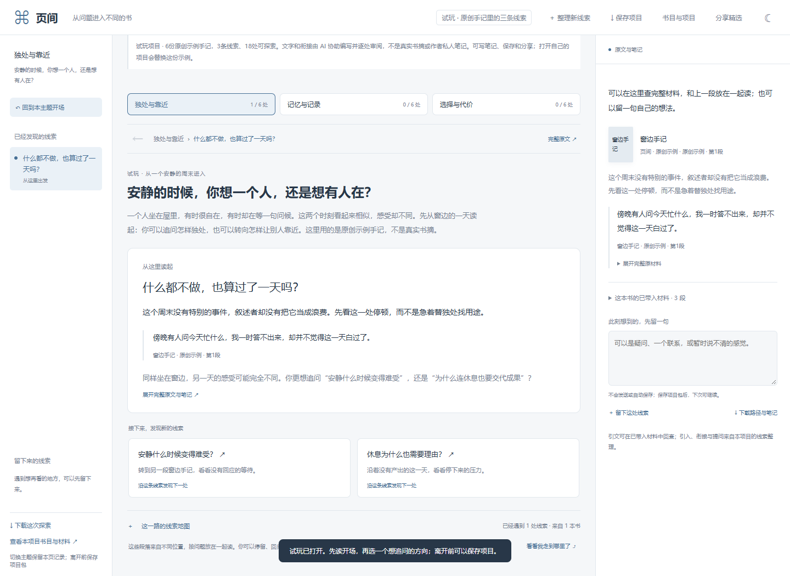

# 页间 · Reading Universe

把自己的书目、划线和笔记，整理成可以沿问题探索的阅读项目。每处先读引入和材料，再选择下一条去路；可以回头、留笔记、保存续读，也可以切换到图谱与阅读星空。

**公开测试版：完整工具与试玩一起提供。**

- [打开完整在线工具](https://atlas.va1z.xyz/atlas/index.html)
- [无需准备，直接试玩](https://atlas.va1z.xyz/atlas/index.html?demo=1)
- [怎样开始](https://atlas.va1z.xyz/guide.html)
- [原阅读宇宙公开站](https://read.va1z.xyz/)（保留原版）

试玩包含6份原创示例手记、3条主题线索、18处可探索，文字由 AI 协助编写并逐处审阅。这是明确标注的虚构材料，不是真实书摘或作者私人笔记。试玩不需要 API key；完整工具的功能均可使用。



## 用自己的材料

免注册。打开项目 JSON、资料 ZIP 或文件夹；没有导出文件，也可以粘贴笔记或你有权使用的摘录开始。微信读书资料需要先自行导出，网站不会登录或自动抓取账号。数据不限于电子书来源。

1. 带入材料，按书目或标签浏览。
2. 选择至少两段材料，写一个想追问的方向。
3. 填写自己的 API key，整理引入、并读和分支草稿；先读一遍，再决定是否加入项目。
4. 沿问题探索、留笔记，下载完整私人项目，下次重新打开继续。
5. 如需分享，逐项选择书目、主题、解读和可选引文，预览后下载可离线探索的网站包。

只有书目时可以看图谱和星空；没有材料时，不会凭书名编造探索段落。图谱与探索可读取同一私人项目格式；已有人工修订、材料和个人记录会保留。详见 [使用说明](docs/USER_GUIDE.md) 和 [数据格式](docs/DATA_FORMAT.md)。

## AI、费用与隐私

- 原始文件在浏览器读取。AI 整理只发送你选择的书名、作者、问题和片段，经网站临时服务交给所选服务商；其余原材料不发送。
- 用户自带 API key，费用由所选服务商收取。网站不保存 key，不提供代付额度或私人云端档案。
- 服务端任务只在内存中，15分钟过期；完成、失败或取消后清理 key 和输入。服务重启可能丢失尚未取回结果。
- 私人项目包含原材料和个人笔记。公开分享另行重建，只包含显式选择的内容；不要把私人项目直接上传 GitHub。
- **DeepSeek 已通过真实合成材料的小样本调用。OpenAI 仅验证了服务器出口可达，尚未验证真实内容生成。** 模型名必须由自己的服务商账户支持。
- 引文和结构检查不等于 AI 理解正确。草稿仍需要本人判断，不能代替对原书的阅读。

刷新或离开前请下载项目包。公开包中的所有内容都可被收到它的人读取。

## 本地运行与自部署

Python 3.10+，无第三方运行依赖：

```bash
python server.py --port 8766
```

打开 <http://127.0.0.1:8766/atlas/index.html> 是完整探索工具；`?demo=1` 打开试玩。<http://127.0.0.1:8766/> 是图谱与星空入口。普通克隆不需要作者工作库或任何私人素材。

生产部署需要有效 HTTPS、同源 `/api/` 和 `READING_ORIGINS`。GitHub Pages 无法单独运行临时 AI 服务。原站 Pages 工作流仅手动触发，并固定使用历史公开版本；新工具独立部署，提交源码不会覆盖原站。详见 [部署](docs/DEPLOY.md) 和 [架构与边界](docs/ONLINE_ARCHITECTURE.md)。Docker 配置尚未实测。

```bash
python tools/package_deploy.py --out /path/to/reading-tool-deploy.zip
```

打包器按明确允许清单收集服务、前端、公开书目与原创试玩，附 SHA256 清单。不带作者私人探索、相邻工作库、凭据、历史数据目录或 Git 历史。

## 开发与验证

Node.js 18+ 仅用于开发、离线 CLI 和生成脚本，普通在线用户无需安装。

```bash
node tools/make_demo.mjs
node tools/build_public_reader.mjs
node --test tests/*.test.mjs
python -m unittest discover -s tests -p "test_*.py" -v
python tests/browser_test.py
python tests/atlas_browser_test.py
python tests/public_exploration_browser_test.py
python tests/onboarding_browser_test.py
```

浏览器测试需要 Playwright 和浏览器，使用模拟 AI 或不调用 AI，不代表所有提供方和任意输入均已验收。探索 UI 的历史模板同步仅供作者开发；正常克隆可直接运行，不需要模板目录。旧 `pipeline/` 和 `data/` 保留为已经公开的历史流程与脱敏案例，不是新用户默认数据。

版本说明见 [公开测试版说明](docs/RELEASE_NOTES.md)。反馈可提交 [Issue](https://github.com/Va1zmmmmm/reading-universe/issues)，请勿附 key 或完整私人项目。

代码与原创试玩材料：MIT。第三方 `vis-network` 保留其随文件提供的许可。
